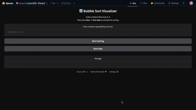
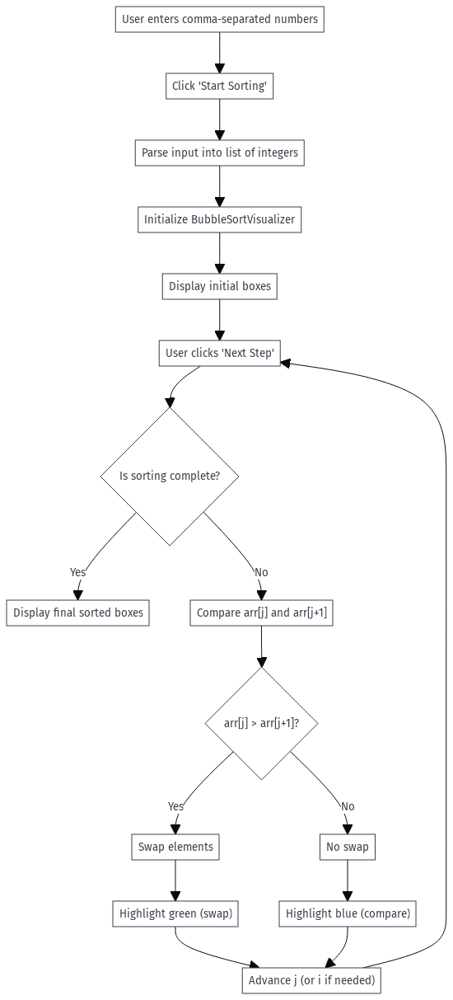

# Author: Henry Oeng

# Course: CISC-121

# Project: Interactive Sorting Algorithm Simulation

# AI Chat log: https://chatgpt.com/share/6938cce3-4264-800a-ab54-834808d799f

## Demo video/gif/screenshot of test

## Problem Breakdown & Computational Thinking (You can add a flowchart , write the four pillars of computational thinking briefly in bullets, etc.)

Problem Breakdown and Computational Thinking
Design an algorithim visualizer (bubble sort) with an interactive step by step visual

1. Decomposition: First we need to take the user input, then run the bubble sort. Then we need to generate the visual version of the list. Each time the user clicks "next step", display feedback

2. Pattern Recognition: Bubble sort will always compare the elements beside it. Swaps only happen when the left value is greater than the right value. The range of comparisions gets smaller each time it iterates. 

3. Abstraction: For the user only show the important stuff like, input box, number of boxes, blue highlight (compare), green highlight (swap). The internal logic is hidden from the user

4. Algorithm Design: I created a step by step version of bubble sort instead of it automatically looping. Each comparision there is blue highlights and each swap there is a green highlight. 

## Steps to Run

1. Enter 5 numbers that are seperated by commas
2. Click "Start sorting"
3. Click "Next step" until desired point in sort

## Hugging Face Link: https://huggingface.co/spaces/heneei/cisc121-final
